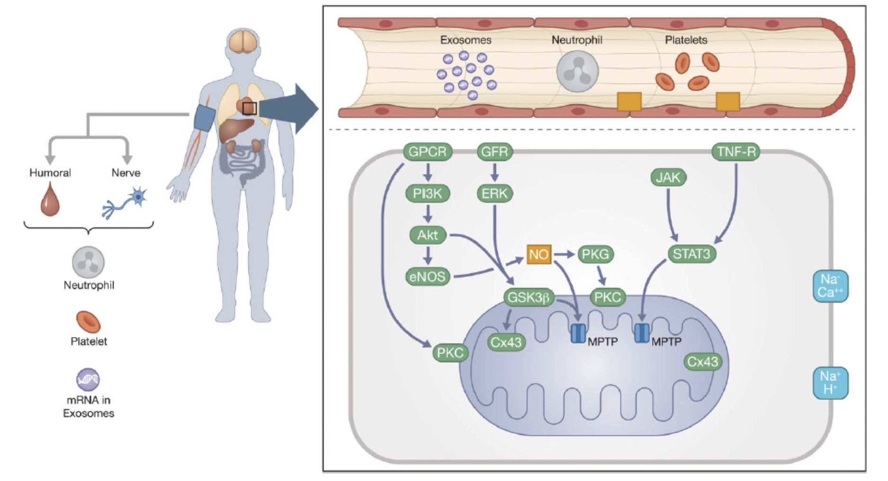
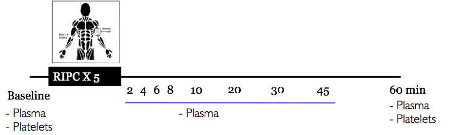
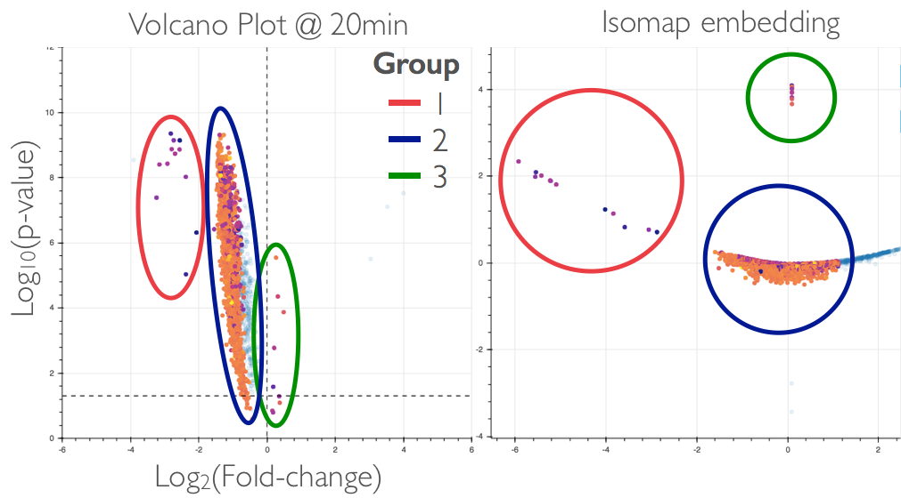
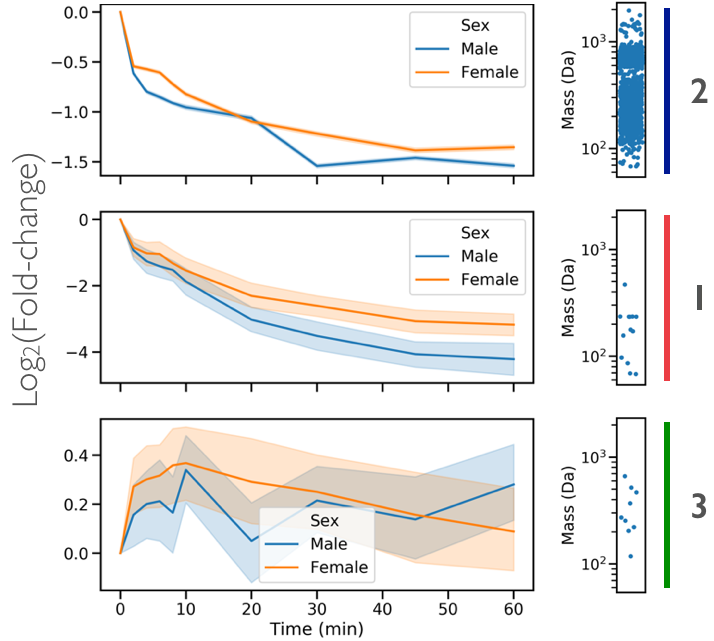

# ml_RIPC

## Introduction
Remote Ischemic Preconditioning (RIPC) is transient mechanical interruption (via BP cuff) of distal organ (upper extremity).
RIPC is thought to be protective of ischemia through inhibition of oxidation and inflammation.

RIPC's mechanism is thought to be both neuronal and humoral.

Neuronal signaling is thought to occur via vagal nerves

Humoral factor transmitted from the ischemic limb to other tissues and organs. The final effect of this factor is to prevent opening of mitochondrial permeability transition pore (MPTP) and prevents apoptosis

## Dataset

## Results

### Targeted metabolites

####  Sex and RIPC metabolites

### Untargeted metabolomic features

#### Volcano plots at each timepoint

#### Linked Volcano Isomap embedding Plots

#### Timeseries for each clustering group

